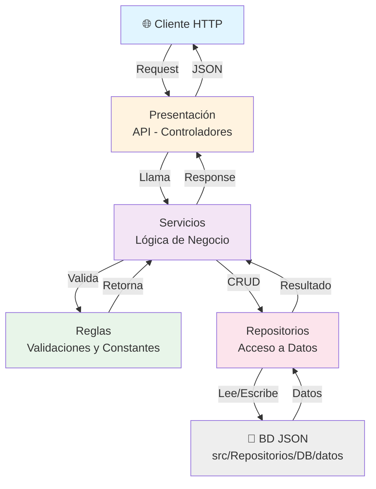

# 4-IntegrationTest

Proyecto de testing e integración con arquitectura de capas.

## Arquitectura



## Capas

### 1. **Presentación** (API - Controladores)
- Ubicación: `src/Presentacion/API/Controladores/`
- Define las rutas HTTP (GET, POST, PUT, DELETE)
- Maneja request/response
- Delega lógica al servicio

### 2. **Servicios** (Lógica de Negocio)
- Ubicación: `src/Servicios/`
- Contiene la lógica de negocio
- Orquesta validaciones y acceso a datos
- Retorna datos procesados

### 3. **Reglas** (Validaciones y Constantes)
- Ubicación: `src/Reglas/`
- Define constantes de errores
- Contiene funciones de validación
- Centraliza reglas de negocio

### 4. **Repositorios** (Acceso a Datos)
- Ubicación: `src/Repositorios/DB/`
- Implementa el patrón Repository
- CRUD sobre archivos JSON
- Abstrae la BD

### 5. **Base de Datos** (Persistencia)
- Ubicación: `src/Repositorios/DB/datos/`
- Archivos JSON por entidad
- `usuarios.json`, etc.

## Scripts

```bash
# Desarrollo
npm run dev              # Con watch
npm run debug:nodemon   # Con debugging

# Producción
npm start               # Ejecución normal
npm run debug          # Con debugging simple

# Testing
npm test               # Ejecutar tests
```

## Instalación

```bash
npm install
```

## Estructura de Carpetas

```
src/
├── Presentacion/
│   └── API/
│       ├── index.js
│       └── Controladores/
│           └── Usuarios/
│               └── index.js
├── Servicios/
│   ├── Usuarios.js
│   └── tests/
│       └── Usuarios.Integracion.js
├── Reglas/
│   ├── Usuarios.js
│   └── Constantes.js
└── Repositorios/
    └── DB/
        ├── baseDeDatos.js
        └── datos/
            └── usuarios.json
```

## Flujo de una Solicitud

1. **Cliente** envía HTTP request
2. **Controlador** (Presentación) recibe y valida formato
3. **Servicio** procesa la lógica
4. **Reglas** valida datos de negocio
5. **Repositorio** accede a datos
6. **BD** persiste/recupera información
7. **Servicio** retorna resultado
8. **Controlador** formatea response
9. **Cliente** recibe JSON

## Manejo de Errores

Los errores se propagan desde el servicio con mensajes constantes:
- `USUARIO_NO_EXISTE` → 404
- `ID_USUARIO_OBLIGATORIO` → 400
- `USUARIO_NO_VALIDO` → 400

El controlador mapea estos errores a códigos HTTP apropiados.

## Development

Ejecuta con debugging:

```bash
npm run debug:nodemon
```

Luego abre VS Code Debug (F5) y selecciona "Attach to Debugger" para conectarte.
